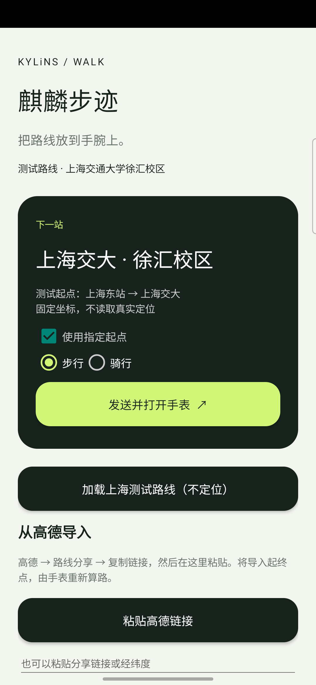
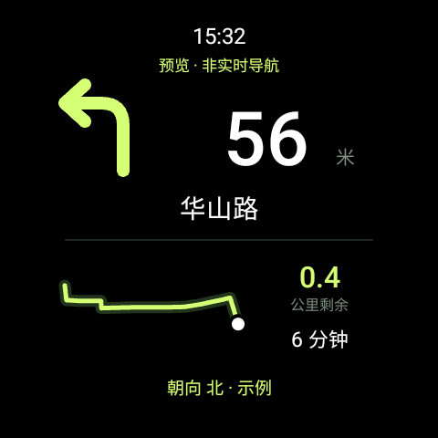

# 麒麟步迹 / Kylins AMap Nav

面向 Samsung Galaxy Watch6 Classic 的独立步行、骑行导航实验应用。手机与手表均使用包名 `com.kylins.amapnav`，版本 0.4.0。

## 测试设备与安装限制

| 设备 | 实测型号 |
| --- | --- |
| 手机 | 三星 Samsung Galaxy S25+ |
| 手表 | 三星 Samsung Galaxy Watch 6 Classic |

**本项目当前版本只能通过 ADB 安装手表应用。** 手机 APP 尚不能通过 Wear 配对连接完成手表 APP 的首次安装，也未实现 APK 推送更新。本项目未在应用商店发布。此限制指本项目当前提供的安装方式，并非所有 Wear OS 应用都必须使用 ADB。

安装完成后，日常发送路线、打开手表路线页和同步调试记录通过 Wear Data Layer / RemoteActivityHelper 工作，**不需要保持 ADB 或无线调试开启**。其他手机、手表型号尚未验证。

## 界面截图

截图在上述实机上运行应用界面取得，使用独立的无 Key 展示构建，未使用设备真实定位或个人导航历史。

**测试路线：上海东站 → 上海交大（上海交通大学徐汇校区）。** 手表展示该公开测试路线接近终点的华山路片段，属于明确标注的界面预览，距离、时间和朝向为固定示例，不能作为正在上海实地导航的证明。

| 手机 APP 主界面 | 手表导航界面（测试数据预览） |
| --- | --- |
|  |  |

公开端点与示例折线来自 2026-09-27 高德查询。上海东站 POI 当时标为“建设中”；整条步行查询约 45.2 公里，仅用于软件展示，不是出行建议。坐标、来源与截图复现方式见 [截图说明](docs/screenshots.md)。

## 实现范围

- 手表独立使用高德 SDK 定位、规划与导航。显示时间、大箭头、下一动作距离、路名、真实路线折线、剩余时间/距离和手表顶端朝向。折线是北向上的局部路线示意，没有道路底图、POI 或地图瓦片。
- 导航使用位置前台服务、Wear OS OngoingActivity 通知、AndroidX AmbientLifecycleObserver。已关闭高德 SDK 默认的屏幕常亮锁。默认「完整显示」在系统息屏显示中仍保留路线和所有字段，降亮、减少刷新并移动像素；长按可选「常亮完整显示」或「省电模式」。省电模式不画路线、不运行方向传感器，保留时间、箭头、距离、路名；导航变化和信息过期仍及时重绘，其余息屏计时刷新降低至每分钟。实际续航差异需要实测，不承诺具体节电比例。
- 朝向取旋转向量传感器、按屏幕旋转修正，指屏幕顶端在水平面上相对磁北的八方向，不是 GPS 行进方向。带平滑和扇区滞回；信号不可靠显示待校准，顶端接近竖直时显示请放平手表，读数过期显示待更新，不虚构方向。省电模式关闭朝向。
- 抬腕唤醒与 AOD 仍受系统设置、佩戴检测和锁屏影响；不绕过锁屏或强行拦截 Home/Back。预览为独立的私有 Activity，路线入口会清理旧预览，预览不会启动导航引擎。
- 手机接收 Android 的文本分享，或在明确点击粘贴按钮后读取剪贴板。支持已实测的高德步行路线短链接、官方 URI 的 walk/ride 起终点和手动 GCJ-02 坐标。
- 默认从手表当前位置导航；勾选「使用指定起点」才使用导入的起点。发送后由手表确认开始。分享只导入起终点，不能保留手机所选路线、途经点或同步手机高德的实时导航状态。
- Wear Data Layer 不依赖 ADB。手机与手表必须正常配对，两个安装包必须同包名、同签名。中国版配套服务的包可见性已声明。
- 手机本地保存最多 2000 条日志；手表补传近期最多 180 条、80 KB。可导出 JSONL。日志包含导航动作、路名、距离与故障，不记录 Key 或精确定位坐标；路线数据本身包含起终点，保存在应用私有区和配对设备 Data Layer。最近日志补传不是无限期离线归档。

## 从高德发送路线

1. 手机高德选择步行路线，打开路线分享，点击「复制链接」。
2. 打开手机「麒麟步迹」，点击「粘贴高德链接」。确认目的地和模式。
3. 点击「发送并打开手表」。应用通过官方 RemoteActivityHelper 请求打开手表路线确认页，短暂亮屏便于操作；点击真正的「开始步行」按钮即可。首次需同意高德隐私说明和定位、通知权限。远程打开受系统支持和锁屏状态限制；失败时仍有路线通知，其「开始步行/骑行」是真实操作按钮，不是说明文字。手机会区分路线收件、发出打开请求和手表已打开路线页。
4. 若高德或其他应用提供系统文本分享面板，可直接选择「麒麟步迹」。高德自有分享面板不一定列出第三方应用，复制链接是已实测方案。
5. 手表必须有可用网络以完成高德算路。手机蓝牙配对不保证所有环境下手表 SDK 网络都可用。

高德 `wb.amap.com` 的 `r=` 步行参数属于实测格式，并非公开稳定接口。当前只识别其步行模式值 2；其他模式拒绝，避免误当步行。官方 URI walk/ride 均支持；来自手机高德的骑行短链接尚未实测。链接只允许精确白名单 HTTPS 域名，最多 5 次跳转，不加载 HTML 或浏览器 Cookie。

## 构建

需要 JDK 17 或更高、Android SDK Platform 35 和 Build Tools，Gradle Wrapper 8.11.1。已在 JDK 21 / Windows 上构建。设置 `ANDROID_HOME` 与 `JAVA_HOME`，复制 `amap.local.properties.example` 为 `amap.local.properties`，填写自己的 Android SDK Key。也可设置环境变量 `AMAP_ANDROID_KEY`。

```powershell
./gradlew.bat :watch:assembleDebug :watch:testDebugUnitTest :watch:lintDebug :phone:assembleDebug :phone:lintDebug
```

Key 必须绑定 `com.kylins.amapnav` 和构建签名的 SHA1。手机模块不使用高德 Key。空 Key 仍可构建预览、分享、通信和日志功能，手表会明确阻止在线导航。

Watch6 Classic 是 32 位设备，手表模块选择包含 armeabi-v7a 的官方 Maven SDK `com.amap.api:navi-3dmap:9.8.2_3dmap9.8.2`。该依赖已包含定位组件，不再重复引入 location。暂时 targetSdk 34，适用于本次侧载实验；商店发布、targetSdk 升级和其他机型另行验证。

安装 `phone/build/outputs/apk/debug/phone-debug.apk` 到手机；安装 `watch/build/outputs/apk/debug/watch-debug.apk` 到手表。两者角色不同，不要混装。`amap.local.properties`、构建产物、签名私钥不提交；SDK 由 Maven 获取。

### ADB 安装步骤

1. 在手机上开启 USB 调试；在手表的开发者选项中开启 ADB 调试 / 无线调试。
2. 电脑与手表连接到可互通的网络。在手表“使用配对码配对”页面取得地址、配对端口和配对码。
3. 执行以下命令。尖括号内容需替换；配对端口和连接端口通常不同。

```text
adb pair <手表IP>:<配对端口>
adb connect <手表IP>:<连接端口>
adb devices
adb -s <手机序列号> install -r phone/build/outputs/apk/debug/phone-debug.apk
adb -s <手表设备标识> install -r watch/build/outputs/apk/debug/watch-debug.apk
```

手机也可以通过文件管理器打开自己构建的手机 APK 安装。两个模块必须使用相同签名；首次导航需在手表同意隐私说明并授予定位、通知权限。安装后可以关闭无线调试。

### Key 与公开发布

- 本仓库不包含个人高德 Key、签名私钥、真实位置日志或预先配置 Key 的 APK。
- 自行申请高德 Android SDK Key，绑定包名 `com.kylins.amapnav` 与自己的签名 SHA1；可通过 `./gradlew.bat :watch:signingReport` 查看本机构建签名。
- `amap.local.properties.example` 是空值模板；实际 `amap.local.properties` 已加入忽略列表。
- **Key 会进入构建后的手表 APK。不要把填入私人 Key 后构建的 APK、AAB 或构建目录公开上传。** `.gitignore` 不能清除已经提交过的内容，发布前仍需检查 Git 暂存区。

### 无定位截图构建

```powershell
./gradlew.bat -Pshowcase :phone:assembleDebug :watch:assembleDebug
```

展示包名为 `com.kylins.amapnav.showcase`，与正式应用数据隔离。它强制使用空手表 Key；手机不连接、发送路线或拉取个人日志，手表直接进入静态预览，不启动导航引擎或方向传感器。手机点击“加载上海测试路线（不定位）”即可复现 README 示例。展示版不能用于真实导航。

## 开源边界

本项目应用层代码、界面和向量图形重新独立编写，采用 MIT，可修改、分发和商业使用，保留许可声明即可。没有包含参考应用的代码、资源或二进制。

高德 SDK、地图数据和 Google Play services 不是本项目可重新许可的内容。因此「本项目源码 MIT 开源」不等于「完整导航栈全部开源或不受第三方服务条件限制」。见 `THIRD_PARTY_NOTICES.md`。

## 官方资料

- [Wear OS 持续显示与持续任务](https://developer.android.com/training/wearables/always-on)
- [OngoingActivity](https://developer.android.com/training/wearables/notifications/ongoing-activity)
- [RemoteActivityHelper](https://developer.android.com/reference/androidx/wear/remote/interactions/RemoteActivityHelper)
- [方向传感器坐标定义](https://developer.android.com/reference/android/hardware/SensorEvent)
- [高德 URI 路线协议](https://lbs.amap.com/api/uri-api/guide/travel/route)
- [高德智能硬件 Link 接口](https://lbs.amap.com/api/aiot-sdk/guide/strong-ties/amaplinkclient-api)
- [智能硬件 Key](https://lbs.amap.com/api/aiot-sdk/guide/create/get-key)

高德 Link SDK 有官方手机高德与硬件联动方案，但需要单独的智能硬件服务权限及鉴权；普通 Android SDK Key 不代表已获该权限。本版本未集成 Link SDK。
