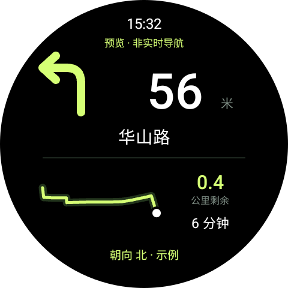

# 麒麟步迹

三星手表高德地图导航工具。

## 功能

- 支持步行、骑行导航，显示转向箭头、距离、路名和局部路线。
- 显示剩余里程、预计用时、当前时间及八方向朝向。
- 支持息屏导航显示、常亮和省电模式，转弯时震动提醒。
- 手机粘贴高德路线链接或手动设置起终点，一键发送到手表。
- 手机查看、导出导航调试记录。

## 截图

| 手机主界面 | 手表导航界面 |
| --- | --- |
|  |  |

## 使用

1. 在手机高德规划路线，分享并复制链接。
2. 打开麒麟步迹，粘贴链接，点击“发送并打开手表”。
3. 在手表确认开始导航；导航中长按屏幕可切换显示模式或结束导航。

测试设备：**三星 Galaxy S25+、Galaxy Watch 6 Classic**。

**当前手表应用只能通过 ADB 安装。** 安装后日常使用无需 ADB，手机与手表保持配对，手表需能联网。

## 申请 Key

1. 登录[高德开放平台控制台](https://console.amap.com/dev/key/app)。
2. 进入“我的应用”，选择应用，点击“添加 KEY”；没有应用则先创建。
3. 选择 **Android 平台**，按页面要求填写信息并提交。
4. 将申请到的 Key 填入本地配置文件，再构建安装。具体见[配置与安装](docs/install.md)。

请使用自己的 Key，不要公开上传 Key 或含私人 Key 的安装包。

## 开源

应用代码采用 [MIT](LICENSE) 许可；第三方服务与 SDK 见[许可说明](THIRD_PARTY_NOTICES.md)。
